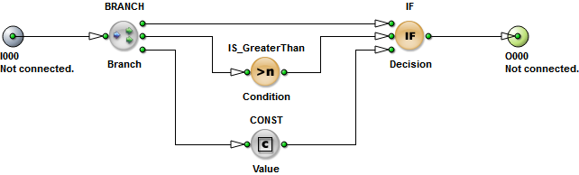

# About visualapplets.py

The [Basler AG](https://www.baslerweb.com) company provides a [TCL](https://wiki.tcl-lang.org/page/An+Introduction+to+Tcl+Scripting) scripting engine
to automatize the creation of VisualApplets designs (a former Silicon Software GmbH technology),
which is a nice and useful feature but not nice enough, in my opinion.

The main idea of the `visualapplets.py` project is to introduce an additional scripting abstraction
and to script the creation of TCL scripts via Python.

Huh, to script a script? Too much meta? Let us study an example...

## Example

In this example we will implement the [ReLU](https://en.wikipedia.org/wiki/Rectifier_(neural_networks)) operator,
which functionally corresponds to `y(x) = max(0, x)`.

Just for practical reasons, we encapsulate the operator logic in a `HierarchicalBox`.
So it can be reused many times in a VisualApplets design.
Consequently we also create a class in our Python script,
for the same purpose of course.

We begin with the first part of the Python script [example.py](example.py):

```python
import visualapplets as VA

class Example(VA.Module):

    def __init__(self, parent, name, x, y):

        # initialize the HierarchicalBox (e.g. super)
        super().__init__('HierarchicalBox', parent, name, i=1, o=1, x=x, y=y)

        # create required modules inside the HierarchicalBox (e.g. self)
        branch = VA.Module('BRANCH', self, 'Branch', o=3, x=1, y=1)
        condition = VA.Module('IS_GreaterThan', self, 'Condition', x=2, y=2)
        value = VA.Module('CONST', self, 'Value', x=2, y=3)
        decision = VA.Module('IF', self, 'Decision', x=3, y=1)

        # link created modules together, from left to right
        self('INBOUND') - branch
        branch(0) - decision
        branch(1) - condition
        branch(2) - value
        condition - decision('C')
        value - decision('E')
        decision - self('OUTBOUND')

        # for instance, set desired link properties
        branch('I')['Bit Width'] = 16        # input link of the BRANCH
        branch('I')['Arithmetic'] = 'signed'
        value('O')['Bit Width'] = 16         # output link of the CONST
        value('O')['Arithmetic'] = 'signed'  # (needs to match the input link)

        # for instance, set desired module properties
        condition['Number'] = 0
        value['Value'] = 0
```

Now the second part of our Python script:

```python
# dump generated TCL script to a file instead of stdout
VA.printer = VA.FilePrinter('example.tcl')

# create a design with an instance of the example module
design = VA.Design('mE5-MA-VCLx', 'Example')
example = Example(design, 'Example', x=1, y=2)
```

Finally import the generated [example.tcl](example.tcl) file in the VisualApplets IDE or execute something like this in the TCL console:

```
CloseDesign Discard
source "C:/foo/bar/example.tcl"
```

The resulting design should look similar to this one:


